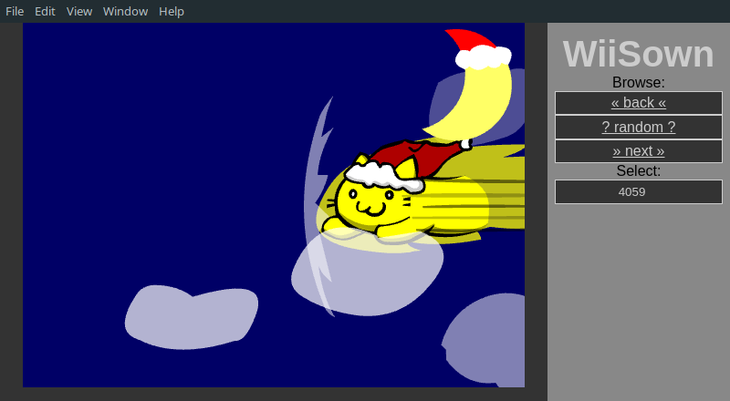

# Sown - a pown.it / WiiPown emulation

Emulates the WiiPown experience using [Angular](https://angular.io/), [Electron](https://www.electronjs.org/) and [ruffle](https://ruffle.rs/) to play funny flash videos in a desktop application.



# Why tho?!

Back in the day my friends and I used to watch thouse videos on pown.it for hours and nights and shared them around quite heavily.
I missed pown.it and especially WiiPown enough to emulate it using angular, electron and ruffle so we can restore some of our internet culture.

# How to use

- Download one of the builds (or build from source)
- download the original flash files from pown.it
- move the files to `WiiSown-(Version)-(arch)/resources/dist/assets/swf`
- run
  - `WiiSown(.exe)` On Windows
  - `sown` on Linux

# How to build

- clone this repo
- build the angular client

```
cd wiiSown/sown-angular
npm install
npm run build-prod
```

- build the electron client from the angular prod files
  - for the Windows build run: `npm run electron-build-win`
  - for the Linux build run: `npm run electron-build-lin`
